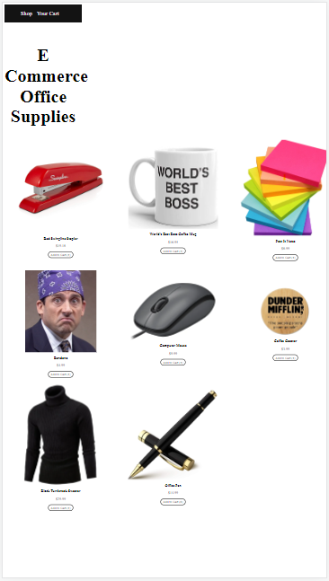

# React E Commerce App MCV

    
     
    

### Model DB is an API, Views handles React .jsx and Controller is handled in App.js 

#### TODO round subtotal to $0.00
#### TODO Add Social Links GitHub, LinkedIn, Profile Website, Twitter, AngelList Talent/Wellfound with FontAwesome
#### TODO Add media queries to the css
#### TODO Create a checkout.jsx under views folder for a checkout 
#### TODO Create a separate branch for MongoDB